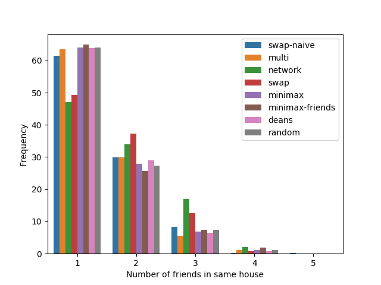

# housing-optimization


Automating and optimizing the Choate housing lottery allocation system.

Made by Max Fan, Ethan Chapman, Ian Haile, Aiyu Kamate, and Jeffrey Zhou for our simulations and optimizations directed study at Choate Rosemary Hall.

## Motivation
Traditionally, housing allocation at Choate Rosemary Hall was done by hand.
Decades ago, this process was done through a lottery, with students randomly selecting numbers out of a hat.
The students would be allocated to the house of their choosing in the ordering of the numbers they received.
This system was later amended to allow for more flexibility, giving Choate students the system, they have today -- a "random" lottery that takes into account everyone's preferences and priorities.

The optimization techniques available have drastically improved since the 20th century.
It is now feasible for normal laptops to churn through hundreds of thousands of possibilities per second.
In addition to the computational leaps made within the past century, there has been great development in the theory of optimization and resource allocation.
We aim to examine and develop several optimization techniques that can take advantage of these recent developments.

## Results
We define choice distribution to be the distribution of n, where n is the ranking of the house each student is assigned to. 
`swap-naive` performs best on choice distributions out of all algorithms examined.
`swap-naive` managed to achieve a 46% reduction in the number of students who got their last three houses *on real historical data* when compared to the `deans-algorithm` and a 15% decrease in the number of students who didn't get their first choice.


Friend distributions are a similiar metric. 
It counts the number of friendships that are preserved. 
`network` performs best on friend distributions.



## Usage
The input files are `input.yaml` and `config.yaml`.
Running `cargo run` will generate an `output.yaml` and `data_output.yaml` file.

Build:
```rs
cargo build --release
```
Run:
```rs
cargo run
```

## Best Performing Algo: swap-naive
`swap-naive` is the best performing algorithm on historical Choate ballots and randomly generated ballots.
`swap-naive` implements a [Metropolis-Hastings]() Monte Carlo Markov Chain, where each step swaps the housing assignments for two given students.
The proposal function uniformly samples from a list of students and the acceptance function is simply the normalized weight of the students' preferences.

To validate the performance of `swap-naive`, we implemented the [constraints in a constraint solver](https://github.com/ChoateProgrammingUnion/housing-optimization/blob/master/constraint-optimizer/experiment.py). This resulted in an identical house choice distribution, which confirmed our expectations.
